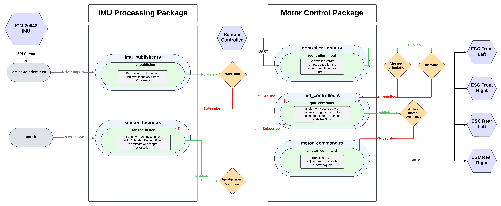

# **Quadcopter From Scratch**

## **Overview**

This project implements a fully functional quadcopter system from scratch, using **Rust** for firmware development and **ROS2** for distributed processing and communication. The goal is to create a modular, extensible, and high-performance quadcopter platform that can stabilize itself in flight, process sensor data, and handle user input.

The project is divided into two main packages:
1. **IMU Processing Package**: Handles sensor data acquisition, filtering, and fusion.
2. **Motor Control Package**: Implements control algorithms and motor command generation.

---

## **Technologies Used**

### **Programming Languages**
- **Rust**: Core development language for high-performance, memory-safe firmware and ROS2 nodes.
- **C/C++**: Possible extensions or integrations where high-performance libraries like OpenCV or specific ROS2 features are required.

### **Frameworks and Libraries**
- **ROS2**: Middleware framework for managing communication between nodes.
- **rclrs**: Rust client library for ROS2.
- **embedded-hal**: Rust-based hardware abstraction layer for embedded systems.
- **linux-embedded-hal**: SPI and GPIO support for the Raspberry Pi.
- [icm-20948-driver](https://github.com/OrlandoQuintana/icm20948-driver-rust): Custom Rust crate for interacting with the ICM-20948 IMU sensor.
- [rust-ekf](https://github.com/OrlandoQuintana/rust-ekf): Custom Rust Extended Kalman Filter crate for quadcopter attitude estimation.

# Bill of Materials (BOM)

## Core Components
- **F450 Quadcopter Frame**: Sturdy frame with pre-soldered ESC connectors.  
  *Source*: [Amazon](https://www.amazon.com/YoungRC-4-Axis-Airframe-Quadcopter-Landing/dp/B0776WLHX7/ref=sr_1_1?s=toys-and-games&sr=1-1)  
- **Raspberry Pi 4**: The onboard computer for controlling the quadcopter.  
  *Source*: [Amazon](https://www.amazon.com/Raspberry-Model-2019-Quad-Bluetooth/dp/B07TC2BK1X/ref=sr_1_1?sr=8-1)  
- **ICM-20948 IMU Evaluation Board**: 9-axis motion sensor for flight stabilization and control.  
  *Source*: [DigiKey](https://www.digikey.com/en/products/detail/tdk-invensense/EV-ICM-20948/7319741)  
- **Holybro Power Distribution Board (PDB) 60A**: Pre-soldered XT60 input and XT30 outputs for power distribution.  
  *Source*: [Holybro](https://holybro.com/products/power-distribution-board-pdb?variant=41590962716861)  

---

## Electronics and Power
- **HRB 14.8V 6000mAh 4S LiPo Battery**: High-capacity battery to power motors, ESCs, and other electronics.  
  *Source*: [Amazon](https://www.amazon.com/gp/product/B0716T67QN/ref=ox_sc_act_title_7?smid=AEXGS89RF8KCG&psc=1)  
- **FainWan UBEC 3A Adjustable Output**: Converts battery voltage to a stable 5V to power the Raspberry Pi.  
  *Source*: [Amazon](https://www.amazon.com/gp/product/B09L6Z67Q8/ref=ox_sc_act_title_4?smid=A3V3IUEMLKZA8F&psc=1)  
- **ReadyToSky 30A ESCs (4-Pack)**: Electronic speed controllers for motor control, compatible with PDB.  
  *Source*: [Amazon](https://www.amazon.com/gp/product/B09G5WFXSV/ref=ox_sc_act_title_3?smid=A1LU71BLX914GS&psc=1)  

---

## Motors and Propulsion
- **Hobbypower Emax MT2213 Motors (4-Pack)**: 935kV brushless motors designed for F450 Quadcopter frame.  
  *Source*: [Amazon](https://www.amazon.com/gp/product/B00EDHXZSK/ref=ox_sc_act_title_8?smid=A3OKQ1PMPIPWYS&psc=1)  
- **Master Airscrew Propellers (10x4.5)**: High-quality, balanced propellers for efficient thrust.  
  *Source*: [Amazon](https://www.amazon.com/gp/product/B0734CF553/ref=ox_sc_act_title_6?smid=AXJHMDL7TGZUF&psc=1)  

---

## Radio Control System
- **FlySky FS-i6X Transmitter + FS-iA6B Receiver**: Reliable 6-channel transmitter and receiver system for piloting the quadcopter.  
  *Source*: [Amazon](https://www.amazon.com/gp/product/B0B3R1K9KC/ref=ox_sc_act_title_2?smid=A27Y3358ST3KOY&psc=1)  

---

## Wiring and Connectors
- **ZHOFONET XT60 Connector Pigtails**: Pre-soldered XT60 connectors for easy power wiring.  
  *Source*: [Amazon](https://www.amazon.com/gp/product/B09M6KQWBL/ref=ox_sc_act_title_5?smid=A7B8LKG94QULK&psc=1)  

---

## Charging and Maintenance
- **B6 LiPo Balance Charger**: Safely charges and balances 4S LiPo battery.  
  *Source*: [Amazon](https://www.amazon.com/gp/product/B09PMP1DS3/ref=ox_sc_act_title_1?smid=A3SYA50HCALWU5&psc=1) 

---

## **Project Architecture**

The quadcopter system is modular, with individual ROS2 nodes performing specific tasks. Below is an explanation of the architecture, based on the above system architecture diagram:

### **1. IMU Processing Package**
#### **Purpose**
- To process raw IMU sensor data and estimate the quadcopter's orientation in real-time.

#### **Components**
1. **`imu_publisher` Node**
   - Reads raw accelerometer and gyroscope data from the ICM-20948 over SPI using the custom ICM-20948 Rust driver.
   - Publishes raw IMU data to the `/raw_imu` ROS2 topic.
   
2. **`sensor_fusion` Node**
   - Subscribes to `/raw_imu` to receive raw accelerometer and gyroscope data.
   - Uses an **Extended Kalman Filter (EKF)** to fuse the data and estimate quadcopter attitude.
   - Publishes the estimated orientation to the `/quaternion_estimate` ROS2 topic.

---

### **2. Motor Control Package**
#### **Purpose**
- To stabilize the quadcopter in flight by adjusting motor speeds based on desired orientation and throttle inputs.

#### **Components**
1. **`controller_input` Node**
   - Reads user input from an Radio controller connected via UART.
   - Publishes the desired orientation and throttle to the `/desired_orientation` and `/throttle` topics.

2. **`pid_controller` Node**
   - Subscribes to `/quaternion_estimate`, `/desired_orientation`, and `/throttle`.
   - Implements a **cascaded PID control system** to calculate the necessary motor adjustments to achieve stable flight.
   - Publishes motor commands to the `/calculated_motor_commands` topic.

3. **`motor_command` Node**
   - Subscribes to `/calculated_motor_commands`.
   - Converts the PID controller output into **PWM signals** to drive the ESCs and control motor speeds.

---

## **Workflow Explanation**

1. **IMU Data Acquisition**:
   - The ICM-20948 IMU provides raw accelerometer and gyroscope data.
   - The `imu_publisher` node reads this data via SPI and publishes it to the `/raw_imu` topic.

2. **Sensor Fusion**:
   - The `sensor_fusion` node fuses accelerometer and gyroscope data using an EKF to compute the quadcopter's attitude.
   - The fused data is published to the `/quaternion_estimate` topic.

3. **User Input**:
   - The `controller_input` node reads user commands (desired roll, pitch, yaw, and throttle) from a Radio controller.
   - These commands are published to the `/desired_orientation` and `/throttle` topics.

4. **Control System**:
   - The `pid_controller` node calculates the motor adjustments required to align the quadcopter's current orientation with the desired orientation while accounting for throttle.
   - The resulting motor commands are published to the `/calculated_motor_commands` topic.

5. **Motor Commands**:
   - The `motor_command` node converts motor adjustment commands into PWM signals to drive the quadcopter's motors via ESCs.

---

## **Topics**

| **Topic Name**          | **Message Type**          | **Description**                                                   |
|--------------------------|---------------------------|-------------------------------------------------------------------|
| `/raw_imu`              | `sensor_msgs/msg/Imu`     | Raw accelerometer and gyroscope data from the ICM-20948 IMU.      |
| `/quaternion_estimate`  | `sensor_msgs/msg/Imu`  | Fused roll, pitch, and yaw data estimated via sensor fusion.      |
| `/desired_orientation`   | `sensor_msgs/msg/Imu` | User-specified desired orientation (roll, pitch, yaw).            |
| `/throttle`              | `std_msgs/msg/Float64`   | User-specified throttle value.                                    |
| `/calculated_motor_commands` | `std_msgs/msg/Float64MultiArray` | Motor adjustment commands from the PID controller.               |

---

## **Future Enhancements**
1. **Magnetometer Integration**:
   - Incorporate the ICM-20948's magnetometer for more accurate heading estimation.

2. **Computer Vision**:
   - Add a wide angle depth camera and utilize computer vision libraries in C++ or Python for obstacle detection, SLAM, yaw angle correction, and more

3. **Autonomous Features**:
   - Add GPS integration for waypoint navigation and autonomous flight modes.

4. **Flight Simulation**:
   - Use Gazebo or similar simulators to test the quadcopter's behavior in a virtual environment.

5. **Hardware Upgrades**:
   - Move flight controller to a dedicated microcontroller for better real time performance. Upgrade flight computer from a Raspberry Pi to a high performance GPU based Nvidia Jetson series computer for higher level robotics applications like real time SLAM, computer vision, AI/ML, and more.

---

## **Conclusion**

This project demonstrates a modular and scalable approach to building a quadcopter system entirely from scratch using Rust and ROS2. By leveraging modern technologies and custom hardware drivers, the project creates a foundation for further research and development in robotics and UAVs.

Feel free to contribute or modify the system to add new features and functionality!
